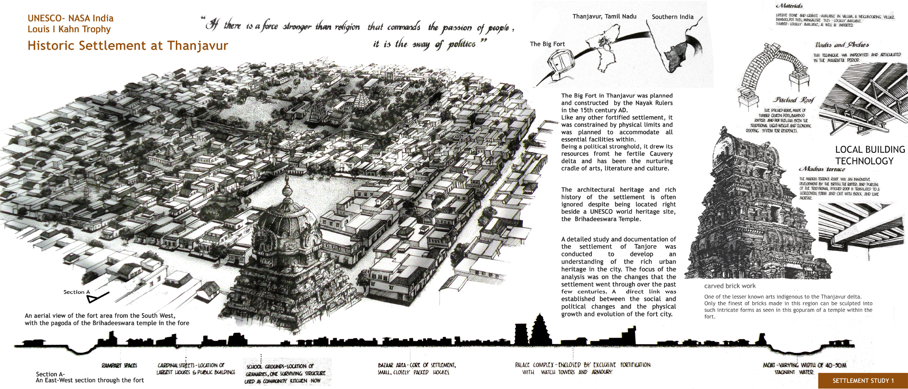

# Home

This is a repository of 16 years of work as a **designer, artist, architect, entrepreneur and educator**. As much as I'd love to give you an easy snapshot of my journey, it's important to me that I resist the reductive force of ever-changing industry labels.

This site is also an early digital garden, I hope to continue to write about my work here. I've tried blogging, micro-blogging and newsletters, none of those formats help me think and communicate freely.&#x20;

To learn more about my relationship to my work, see [about.md](about.md "mention")

Explore projects and notes through the menu on the left (or top-left on mobile devices)&#x20;

Happy browsing!

***

#### I do have some favorites to highlight&#x20;

### Card page redesign for Aspire, YC W18

_Role: Sr. Product Designer on the Expense Management Team_\

Learn more:\
[financeos-for-startups.md](design-pages/product-design/financeos-for-startups.md "mention")



***

### The Hungry Number Monster&#x20;

An inclusive educational product designed, produced and marketed by <mark style="color:red;">**Tactopus (acquired)**</mark>\
_Role: Founder, designer_\
\
Learn more:\
[the-hungry-number-monster.md](design-pages/spatial-interaction-design/tactopus-inclusive-learning-with-mr/the-hungry-number-monster.md "mention")\

<figure><figcaption></figcaption></figure>

***

### Mirror Game

Learning about light with mirrors, a residency project at Agastya Foundation\
\
Learn more: \
[libo-mirror-game-to-learn-light-behavior-for-agastya-foundation.md](design-pages/game-design/libo-mirror-game-to-learn-light-behavior-for-agastya-foundation.md "mention")


Challenge: Use at least 4 mirrors to beam sunlight into target number II


***

### Augmented Reality Tools for Education

AR app to help children explore solid sections \
\
Learn more:\
&#x20;[augmented-geometry.md](design-pages/spatial-interaction-design/augmented-geometry.md "mention")



