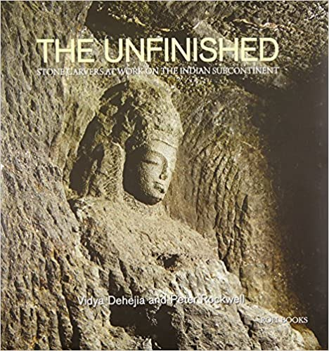

# 🔨 Technical Illustrations for the Book "The Unfinished: The Stone Carvers at Work in the Indian Subcon

When I was a student at NIT Trichy, I got the opportunity to work with Prof. Vidya Dehejia and Sculptor Peter Rockwell. The assignment was to create technical illustrations for the book they were working on, to decipher the stone sculpting technology and process by studying rock cut temples and other samples of stone carvers' work in various stages of completion

📔 Buy the book here: [**Amazon Link**](https://www.amazon.com/Unfinished-Stone-Carvers-Indian-Subcontinent/dp/9351941140)

Blurb:  The sheer number of unfinished stone monuments in India is staggering and examples appear at some of India's most famous and well-studied sites that include rock-cut Ellora, Ajanta, and Mamallapuram. Unfinished work also appears on built temples celebrated for the intricacy of their sculpted decoration, such as those in Hoysala kingdom or in Orissa. This detailed study provides an overall coverage of India's unfinished work while addressing a range of issues related to stone-carving by examining a select number of monuments at specific sites. Instead of focusing on a site in its entirety, the study here focuses on specific issues of consequence in the context of unfinished work, as they gain an added weight and significance through discovery of their repetitive occurrence at site after site. \
At the heart of this book are the many varieties of unfinished stone carving that merit close observation to see what is there and what is not, and to appreciate that all the finished work has been through these various stages of being unfinished before reaching completion.

***

<figure><figcaption></figcaption></figure>

 

<figure><figcaption></figcaption></figure>

<figure><figcaption></figcaption></figure>

<figure><figcaption>
Above: The team, Geslin George, Kumar Abhishek and me, with the authors.
</figcaption></figure>

<figure><figcaption>
Rock-cut temple in Madurai, being carved out from top to bottom, stages of carving clearly visible upon close inspection.
</figcaption></figure>

<figure><figcaption>
Shrines carved out of large boulders, in various stages of finish
</figcaption></figure>

<figure><figcaption>
Shrines carved out of large boulders, in various stages of finish
</figcaption></figure>

<figure><figcaption>
Arjuna's Penance, highlighting the progress of the artist(s)and possibly unfinished portions.
</figcaption></figure>

<figure><figcaption>
The lower levels of the Brihadeeshwara temple, a UNESCO world heritage site. The temple is over 2000 years old.
</figcaption></figure>

It was a rewarding experience to work with eminent historians, and the job involved travel, drawing, hearing a lot about the history we were supposed to represent in the drawings. Of course, really proud of the drawings making it to the final publication.
