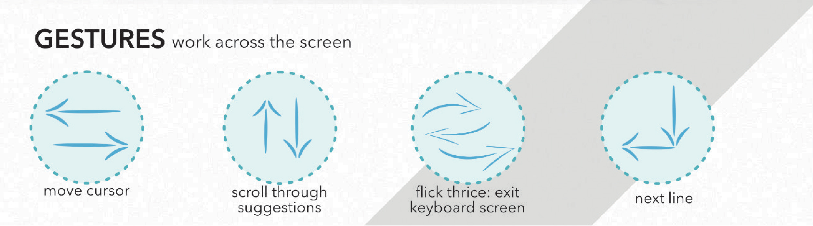
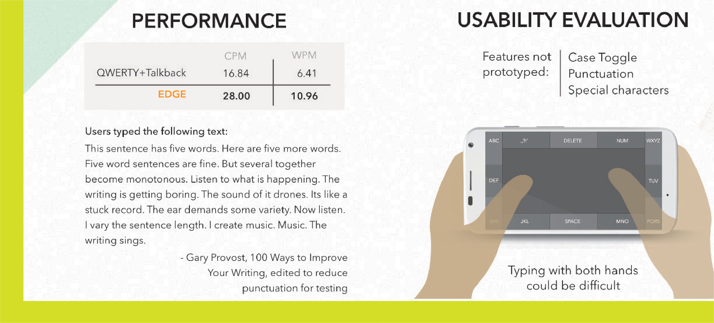
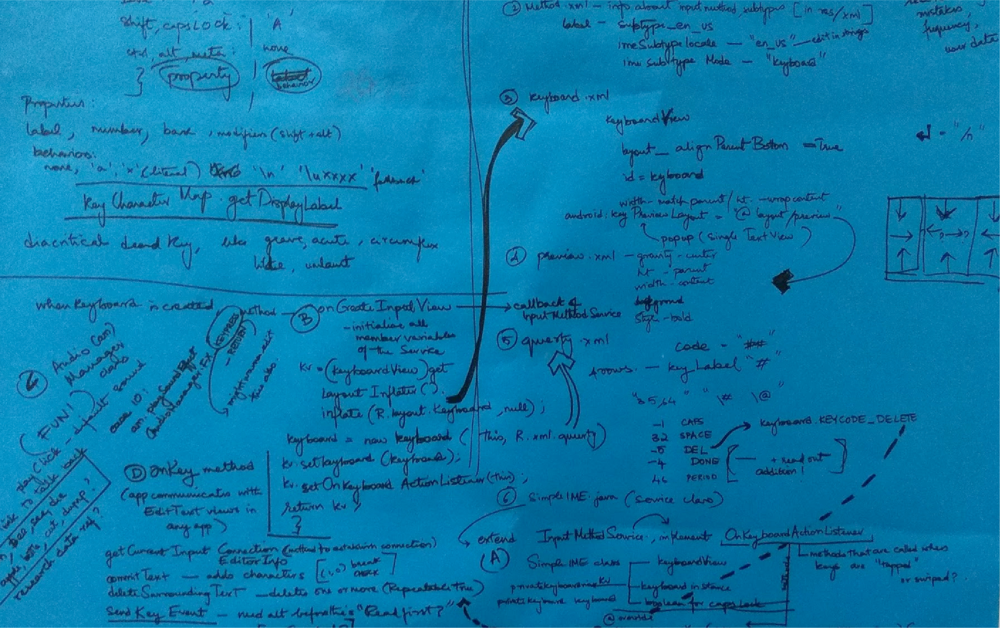

# ⌨ Accessible Keyboard (CHI 2016)

<figure><figcaption></figcaption></figure>

### Edge: Smartphone Typing When Blind

Design of a text-input system that uses the edges of a smartphone as tangible markers, making it easy for people with vision loss to type on touch screen phones.

Finalist at Student Design Competition, CHI 2016, San Jose.

ACM Digital Library Link: [EGDE, A Soft Keyboard for Fast Typing for the Visually Challenged](https://dl.acm.org/doi/10.1145/2851581.2890635)

### Presentation at CHI 2016, San Jose



I was introduced to accessibility in HCI when I met a colleague who was blind since birth. When I spent more time with him, I noticed that of all the accessibility gestures he used on his phone, he was most confident with the two finger swipe down from the top - to pull down the notifications bar.

Clearly, having a tangible edge as a marker made the action considerably easier. That sparked the idea to explore if more of the gestures could leverage the sides of the phone. In this project, I've looked at the use of phone edges in typing.

<figure><figcaption></figcaption></figure>

<figure><figcaption></figcaption></figure>

<figure><figcaption></figcaption></figure>

<figure><figcaption></figcaption></figure>

<figure><figcaption></figcaption></figure>

<figure><figcaption></figcaption></figure>

<figure><figcaption></figcaption></figure>

<figure><figcaption>
some working documents :) 
</figcaption></figure>

### Full poster

<figure><figcaption></figcaption></figure>

### Product Demo


