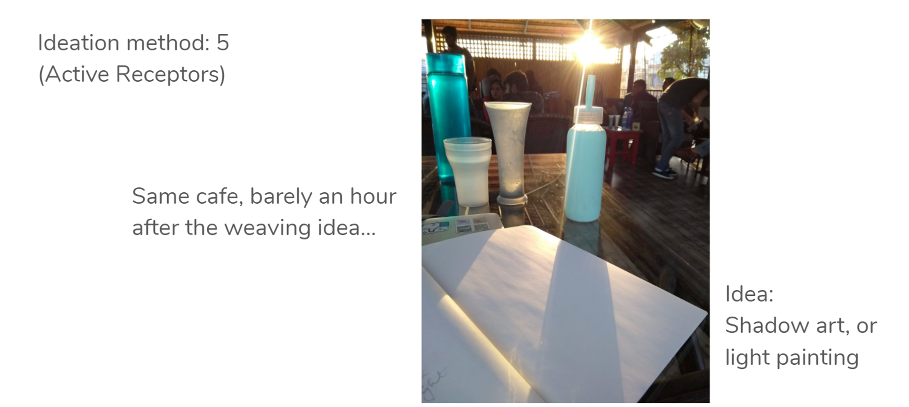

# 🎮 Game Platform

<figure><figcaption></figcaption></figure>

***

### Hyper-casual Game Discovery Through Short Videos

This hyper-casual game startup is based primarily on ad-revenue. The key differentiator of our games was that they were built to be "oddly satisfying", a niche category the team has created within mobile gaming.

Who plays our games? The design team goes after 'universal appeal' and prefers not to use personas or think of a user segment. The definition was instead in the form of a state of mind - anybody who's looking to kill time, wants to fiddle with their phone. These games keep the mind and hands occupied, they're very much like fiddle toys. They must be easy to learn to play, require very little attention, reward often, and the difficulty levels must only increase ever so gently. 60% users drop off within the first ten levels. If any level was unplayable, there would be a clear spike in drop off rates, and could be corrected immediately.

From the user acquisition team, we know that the typical player is an Instagram user, over 60% were between the ages 14-24, but they suspect there could be more younger players using their parents' phones. Users are distributed globally, with rapidly rising numbers in India, Indonesia and South America. In terms of ad-revenue, however, all these markets put together did not match the revenue from US alone. Ads served in the US earned many times more than an ad in India, but also had higher CPIs (cost per install). This is a natural consequence - 97% installs were through ads.

As a product designer in an R\&D role, I worked on some experimental features and new products.

One of them, Playlist, is an app for mobile game enthusiasts to save games they've played, want to play or would recommend to peers. The key hypothesis is that the Playstore or App Store discovery experience is rather generic and doesn't work very well for games- a challenge faced by our marketing team first-hand. It was nearly impossible to increase organic installs. These games are best communicated through short videos of the gameplay, and a few seconds are typically enough to express the game mechanic or core-loop.


If our experience were to prioritise **game discovery**, what would that look like?


