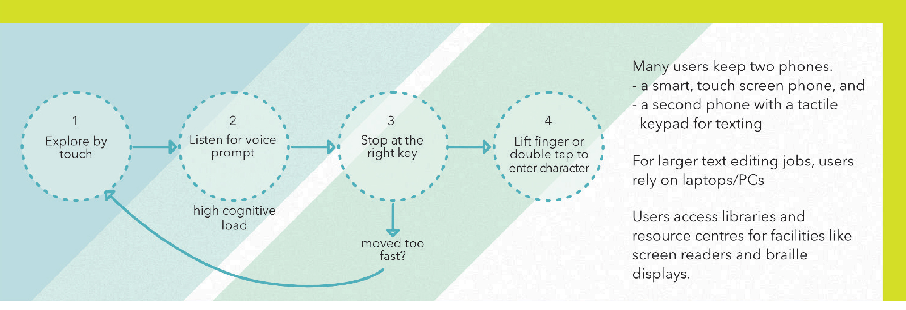

# HCI for emerging users in India

<figure><figcaption></figcaption></figure>

#### Intent

The objective of the study was to investigate smartphone usage, behaviors, attitudes among people who had completed education upto class 10. We interviewed over a hundred users in both Mumbai, a metropolitan city, in Wai, a small town in Maharashtra, and a small village right outside Wai, called Menawali.

➕ [ACM Digital Library](https://dl.acm.org/doi/10.1145/3014362.3014367)

<figure><figcaption></figcaption></figure>

In Mumbai, we interviewed shop keepers, traders, service-job holders, politicians, senior citizens, and many of them were migrants from other parts of the country.

<figure><figcaption></figcaption></figure>

In Wai, our findings were that many users had the same apprehensions about smartphones irrespective of level of education. Children were the only demographic that seem to be completely comfort. We also discovered that data was unaffordable to most, hence the prevalence of innovative sharing apps such as ShareIt.

<figure><figcaption></figcaption></figure>

In Menawali, WhatsApp groups were the primary source of news, information and ways for the community to organise. The entire village was, for the first time, digitally connected on WhatsApp.

This was my first time dealing with this degree of complexity in data, largely qualitative. We did an affinity mapping exericise to process all this layered information and abstract patterns from it.

We were able to compare and contrast attitudes towards WhatsApp vs Facebook, the innovative appropriation of WhatsApp into a business communication tool by small time traders, mechanics, and other service professionals.

<figure><figcaption></figcaption></figure>

<figure><figcaption></figcaption></figure>

<figure><figcaption></figcaption></figure>

<figure><figcaption></figcaption></figure>

<figure><figcaption></figcaption></figure>

<figure><figcaption></figcaption></figure>

It's now four years since the study, and so much of it looks irrelevant. With Reliance Jio making internet accessible and widely prevalent, and the advent of TikTok, one would find a dramatically different view of technology adoption among the very same users. It's stunning, exciting how rapidly everything changes in the digital world, I'm glad to have been able to study and document a slice of this fast-changing sector, a slice that may not exist to go back to today.

Chinmay Parab, Nazreen Nizam and I, also worked with Devanuj Balakrishnan, a PhD candidate at IDC, where we used data from this research to corroborate the user-usage model among emergent users. Devanuj's study was published in IndiaHCI with co-author and guide, Prof. Anirudha Joshi.

